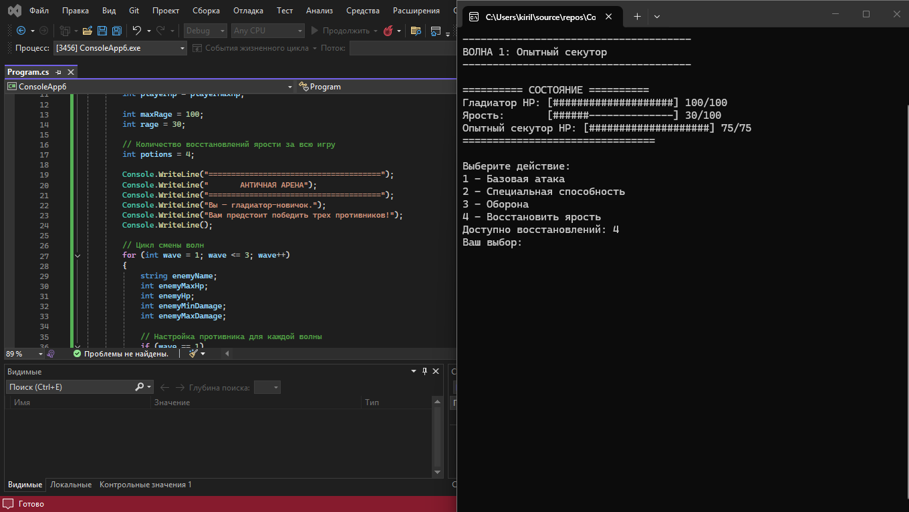
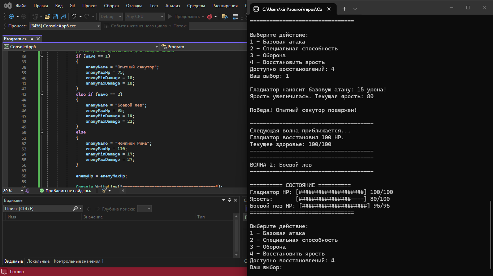
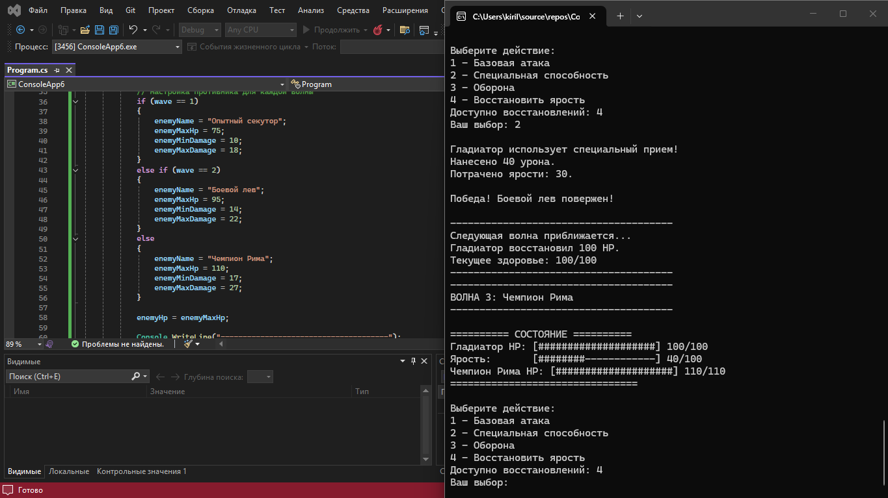
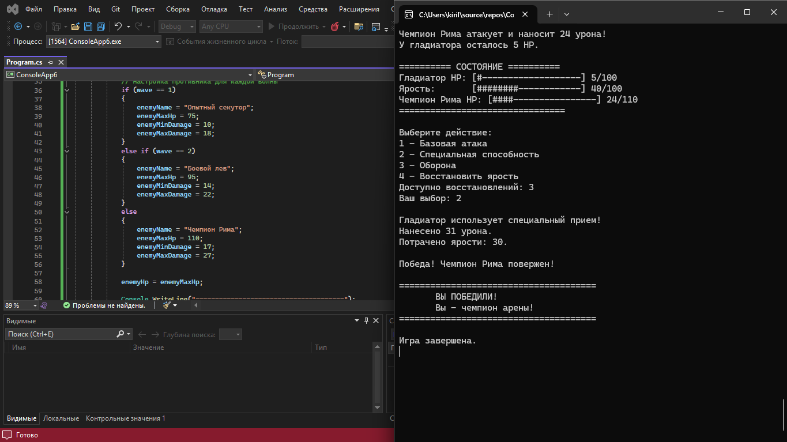

# Практическая работа 
## Выполнил студент группы П25-2.1. Безруков Кирилл Витальевич

### Античная арена


```csharp

using System;

class Program
{
    static void Main()
    {
        Random rnd = new Random();

        // Параметры героя
        int playerMaxHp = 100;
        int playerHp = playerMaxHp;

        int maxRage = 100;
        int rage = 30;

        // Количество восстановлений ярости за всю игру
        int potions = 4;

        Console.WriteLine("======================================");
        Console.WriteLine("       АНТИЧНАЯ АРЕНА");
        Console.WriteLine("======================================");
        Console.WriteLine("Вы — гладиатор-новичок.");
        Console.WriteLine("Вам предстоит победить трех противников!");
        Console.WriteLine();

        // Цикл смены волн
        for (int wave = 1; wave <= 3; wave++)
        {
            string enemyName;
            int enemyMaxHp;
            int enemyHp;
            int enemyMinDamage;
            int enemyMaxDamage;

            // Настройка противника для каждой волны
            if (wave == 1)
            {
                enemyName = "Опытный секутор";
                enemyMaxHp = 75;
                enemyMinDamage = 10;
                enemyMaxDamage = 18;
            }
            else if (wave == 2)
            {
                enemyName = "Боевой лев";
                enemyMaxHp = 95;
                enemyMinDamage = 14;
                enemyMaxDamage = 22;
            }
            else
            {
                enemyName = "Чемпион Рима";
                enemyMaxHp = 110;
                enemyMinDamage = 17;
                enemyMaxDamage = 27;
            }

            enemyHp = enemyMaxHp;

            Console.WriteLine("--------------------------------------");
            Console.WriteLine($"ВОЛНА {wave}: {enemyName}");
            Console.WriteLine("--------------------------------------");

            // Главный игровой цикл
            while (playerHp > 0 && enemyHp > 0)
            {
                Console.WriteLine();
                Console.WriteLine("========== СОСТОЯНИЕ ==========");

                // Полоса здоровья игрока
                Console.Write("Гладиатор HP: [");

                int playerBars = playerHp * 20 / playerMaxHp;

                for (int i = 0; i < playerBars; i++)
                {
                    Console.Write("#");
                }

                for (int i = playerBars; i < 20; i++)
                {
                    Console.Write("-");
                }

                Console.WriteLine($"] {playerHp}/{playerMaxHp}");

                // Полоса ярости игрока
                Console.Write("Ярость:       [");

                int rageBars = rage * 20 / maxRage;

                for (int i = 0; i < rageBars; i++)
                {
                    Console.Write("#");
                }

                for (int i = rageBars; i < 20; i++)
                {
                    Console.Write("-");
                }

                Console.WriteLine($"] {rage}/{maxRage}");

                // Полоса здоровья противника
                Console.Write($"{enemyName} HP: [");

                int enemyBars = enemyHp * 20 / enemyMaxHp;

                for (int i = 0; i < enemyBars; i++)
                {
                    Console.Write("#");
                }

                for (int i = enemyBars; i < 20; i++)
                {
                    Console.Write("-");
                }

                Console.WriteLine($"] {enemyHp}/{enemyMaxHp}");

                Console.WriteLine("================================");
                Console.WriteLine();
                Console.WriteLine("Выберите действие:");
                Console.WriteLine("1 — Базовая атака");
                Console.WriteLine("2 — Специальная способность");
                Console.WriteLine("3 — Оборона");
                Console.WriteLine("4 — Восстановить ярость");
                Console.WriteLine($"Доступно восстановлений: {potions}");

Kkkiml:


                int action;
                bool isValid;

                // Ввод с проверкой через do-while
                do
                {
                    Console.Write("Ваш выбор: ");

                    isValid = int.TryParse(Console.ReadLine(), out action)
                              && action >= 1
                              && action <= 4;

                    if (!isValid)
                    {
                        Console.WriteLine("Ошибка! Введите число от 1 до 4.");
                    }

                } while (!isValid);

                bool defending = false;

                // Обработка действия через switch
                switch (action)
                {
                    case 1:
                        // Базовая атака
                        int basicDamage = 15;

                        enemyHp -= basicDamage;

                        // За успешную атаку герой получает ярость
                        rage += 10;

                        if (rage > maxRage)
                        {
                            rage = maxRage;
                        }

                        Console.WriteLine();
                        Console.WriteLine(
                            $"Гладиатор наносит базовую атаку: {basicDamage} урона!"
                        );

                        Console.WriteLine(
                            $"Ярость увеличилась. Текущая ярость: {rage}"
                        );

                        break;

                    case 2:
                        // Специальная способность
                        int rageCost = 30;

                        if (rage >= rageCost)
                        {
                            int specialDamage = rnd.Next(28, 41);

                            enemyHp -= specialDamage;
                            rage -= rageCost;

                            Console.WriteLine();
                            Console.WriteLine(
                                $"Гладиатор использует специальный прием!"
                            );

                            Console.WriteLine(
                                $"Нанесено {specialDamage} урона."
                            );

                            Console.WriteLine(
                                $"Потрачено ярости: {rageCost}."
                            );
                        }
                        else
                        {
                            Console.WriteLine();
                            Console.WriteLine(
                                "Недостаточно ярости для специальной способности!"
                            );

                            // Пропускаем ход противника
                            continue;
                        }

                        break;

                    case 3:
                        // Защита
                        defending = true;

                        Console.WriteLine();
                        Console.WriteLine(
                            "Гладиатор принимает защитную стойку."
                        );

                        Console.WriteLine(
                            "Получаемый урон в этом ходу будет уменьшен вдвое."
                        );

                        break;

                    case 4:
                        // Восстановление ярости
                        if (potions > 0)
                        {
                            int restore = 40;

                            rage += restore;

                            if (rage > maxRage)
                            {
                                rage = maxRage;
                            }

                            potions--;

                            Console.WriteLine();
                            Console.WriteLine(
                                $"Гладиатор восстанавливает {restore} ярости."
                            );

                            Console.WriteLine(
                                $"Текущая ярость: {rage}/{maxRage}"
                            );

Kkkiml:


                            Console.WriteLine(
                                $"Осталось восстановлений: {potions}"
                            );
                        }
                        else
                        {
                            Console.WriteLine();
                            Console.WriteLine(
                                "Восстановления закончились!"
                            );

                            // Если ресурс закончился, ход противника
                            // не пропускаем, поэтому continue не используем.
                        }

                        break;
                }

                // Не допускаем отрицательного HP
                if (enemyHp < 0)
                {
                    enemyHp = 0;
                }

                // Проверка победы до атаки противника
                if (enemyHp <= 0)
                {
                    Console.WriteLine();
                    Console.WriteLine($"Победа! {enemyName} повержен!");
                    break;
                }

                // Ход противника
                int enemyDamage = rnd.Next(enemyMinDamage, enemyMaxDamage + 1);

                if (defending)
                {
                    enemyDamage /= 2;
                }

                playerHp -= enemyDamage;

                if (playerHp < 0)
                {
                    playerHp = 0;
                }

                Console.WriteLine();
                Console.WriteLine(
                    $"{enemyName} атакует и наносит {enemyDamage} урона!"
                );

                Console.WriteLine(
                    $"У гладиатора осталось {playerHp} HP."
                );

                // Проверка поражения
                if (playerHp <= 0)
                {
                    Console.WriteLine();
                    Console.WriteLine("Гладиатор пал на арене!");
                    break;
                }
            }

            // Если герой погиб — завершаем игру
            if (playerHp <= 0)
            {
                break;
            }

            // Если это была последняя волна
            if (wave == 3)
            {
                Console.WriteLine();
                Console.WriteLine("======================================");
                Console.WriteLine("       ВЫ ПОБЕДИЛИ!");
                Console.WriteLine("       Вы — чемпион арены!");
                Console.WriteLine("======================================");
                break;
            }

            // Небольшое восстановление между волнами
            int recovery = 100;

            playerHp += recovery;

            if (playerHp > playerMaxHp)
            {
                playerHp = playerMaxHp;
            }

            Console.WriteLine();
            Console.WriteLine("--------------------------------------");
            Console.WriteLine("Следующая волна приближается...");
            Console.WriteLine(
                $"Гладиатор восстановил {recovery} HP."
            );
            Console.WriteLine(
                $"Текущее здоровье: {playerHp}/{playerMaxHp}"
            );
            Console.WriteLine("--------------------------------------");
        }

        if (playerHp <= 0)
        {
            Console.WriteLine();
            Console.WriteLine("======================================");
            Console.WriteLine("            ПОРАЖЕНИЕ");
            Console.WriteLine("======================================");
            Console.WriteLine("Арена оказалась сильнее гладиатора.");
        }

        Console.WriteLine();
        Console.WriteLine("Игра завершена.");
        Console.ReadKey();
    }
}
```
---
<picture>  
</picture> 

<picture>  
</picture>

<picture>  
</picture>

<picture>  
</picture>
